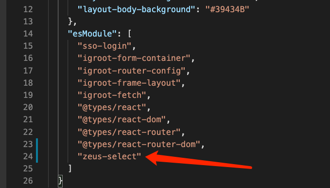

# Zeus-select 下拉组件
## 引用示例:
* 安装zeus-select
```javascript
yarn add zeus-select
```
* 修改bsy.json
```json
// 在esModule属性中,增加 "zeus-select" 包引用
```


* 在项目中使用
```jsx
  // 引入zeus-select模块
  import ZeusConfig from "zeus-select";

  // 使用方式
  <ZeusSelect api="https://balbala" mode="multiple" type="domain" keyword="name" placeholder="选择域名" />
```

> 组件API

| 组件提供属性 | 属性类型                     | 默认值                                    | 备注           | 必填 |
| ----------------- | ---------------------------- | ----------------------------------------- | -------------- | -------- |
| mode              | String                       | -                                         | 多选\| 单选    | 否       |
| keyword           | "id" \| "name"               | "name"                                    | 显示id或者name | 否       |
| width             | String\| number              | 100%                                      | 宽度默认“100%” | 否       |
| type              | "domain"\|"machine"\|"cache"\|"user"\|"cover"\|"node" | "domain"                                  | 查询类型       | 是       |
| placeholder       | String                       | -                                         | 提示说明文字   | 否       |
| tag               | "id"\|"name"                 | "name"                                    | 查询类型       | 是       |
| api               | String                       | https://api.xxx.com | 后端查询域名   | 是       |


